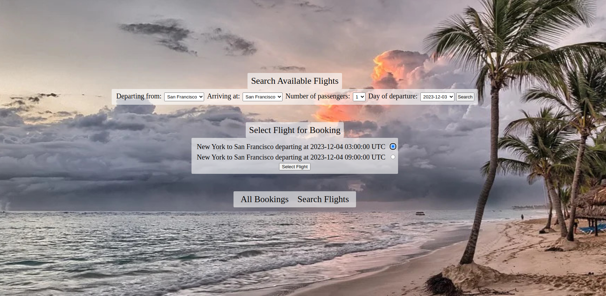

# Flight Booker

[Flight Booker](https://mg-flights.herokuapp.com/) is a Rails website which allows users to search available flights and book flights on specific dates for a selected number of passengers. 

## Demo

## Live

Play around with the [live version deployed on Heroku](https://mg-flights.herokuapp.com/). Select an the arriving and departing airport, number of passengers, flight date - and book a flight! Look through all the previously booked flights after you're done. 

## Features

- Use MVC design pattern to separate models and views from controllers for ease of code maintainability
- Create multiple objects with a single form through the use of nested forms and nested attributes
